# CollabCube
Sourcode for CollabCube


# Installation
* 1 - clone repo https://github.com/jaswanth9959/CollabCube/
* 2 - create a virtual environment and activate
*  - pip install virtualenv
*  - virtualenv envname
*  - envname\scripts\activate
* 3 - cd into project "cd CollabCube"
* 4 - pip install -r requirements.txt
* 5 - Create an account on agora.io and create an app to generate an APP ID
* 6 - Update APP ID, Temp Token and Channel Name in streams.js of static/js directory and in views.py of videochat/ directory
```javascript
let APP_ID = "YOU-APP-ID"
```
```javascript
appId = ""
appCertificate = ""
```
* 7 - Update EMAIL_HOST_USER, EMAIL_HOST_PASSWORD in settings.py of collabcube/ for sending mails to users.
```javascript
EMAIL_HOST_USER = "YOUR EMAIL ID"
EMAIL_HOST_PASSWORD = "YOUR EMAIL PASSWORD"
```
* 8 - python manage.py runserver


# Features
* Share Projects
* Message other students
* Rate others work
* Search other students
* Video Conference
* Groups similar to WhatsApp
* Resume Builder
* Notes and Announcements section for students
* Collaborative Editor 

# Tech Stack
* Django
* Postgres
* AWS

# Home Page
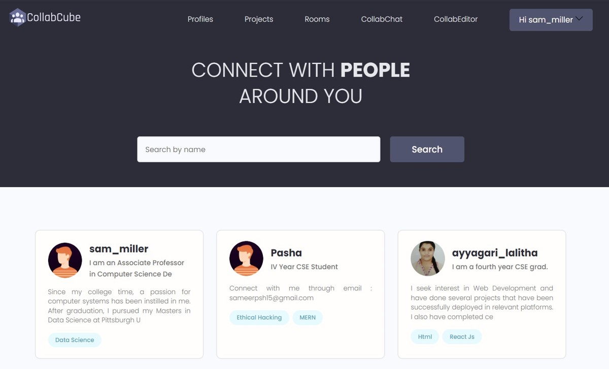


# Projects Page
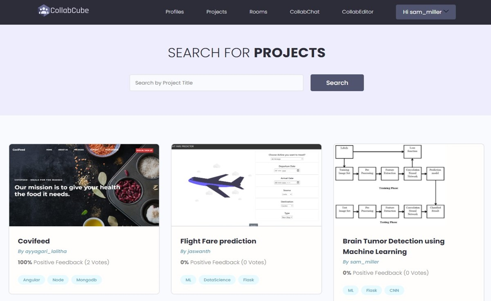


# Account Page
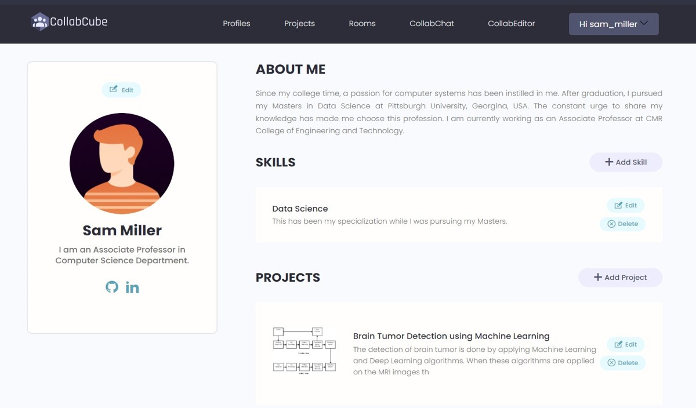


# User Profile Page
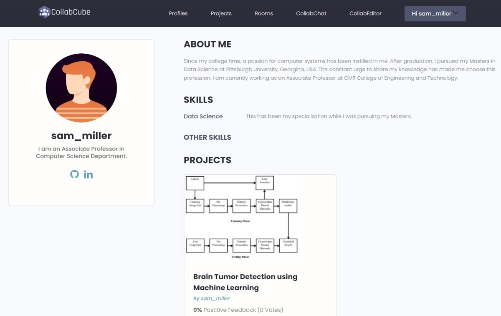


# User Project Page
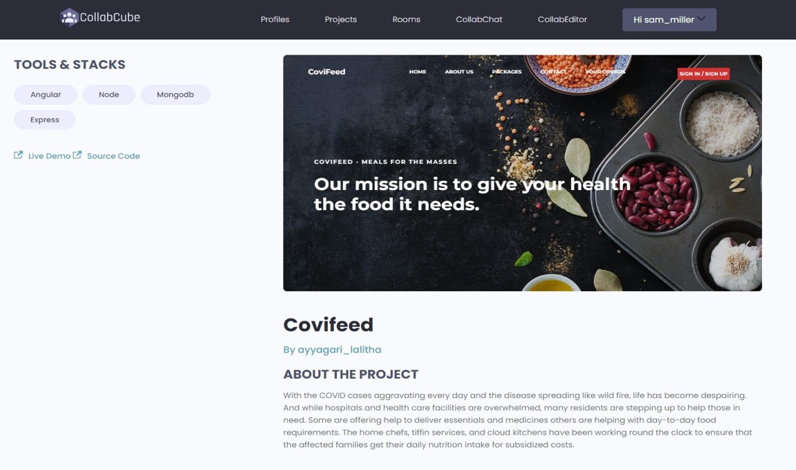


# Rooms Page
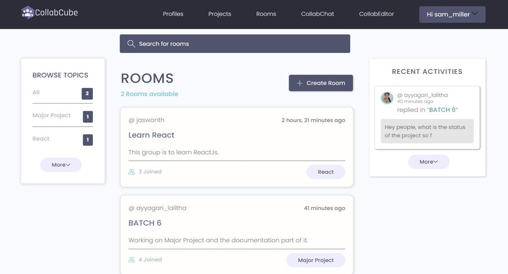
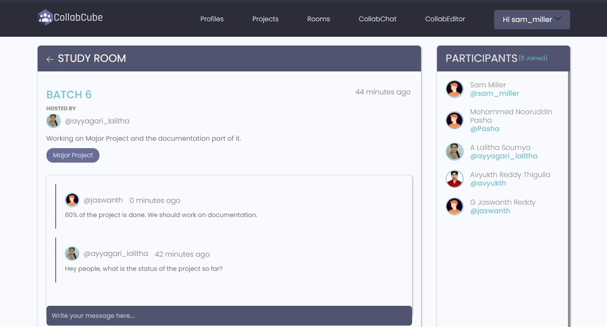


# Video Conference Page
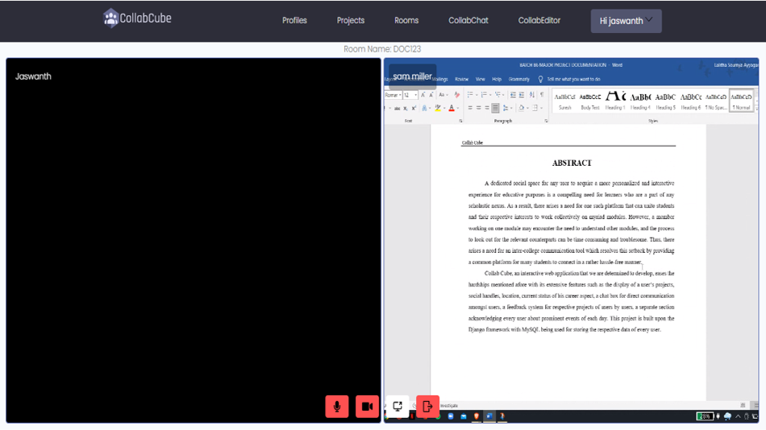


# Collaborative Editor Page
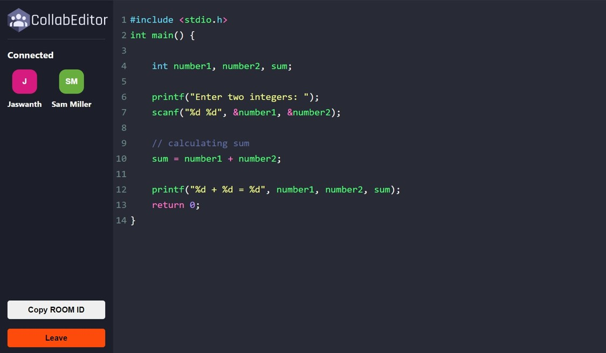


# Resume Builder Page
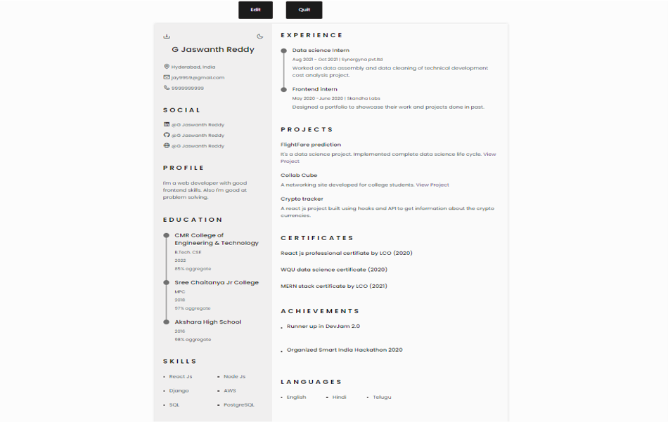


# Notes Page
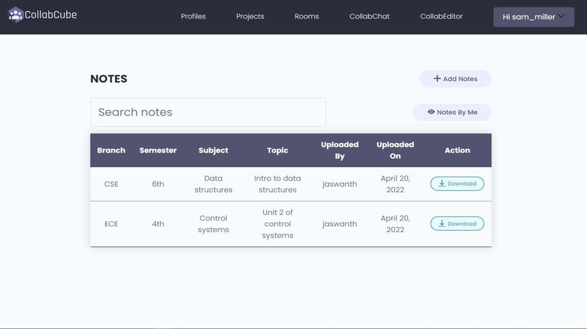


# Announcements Page

